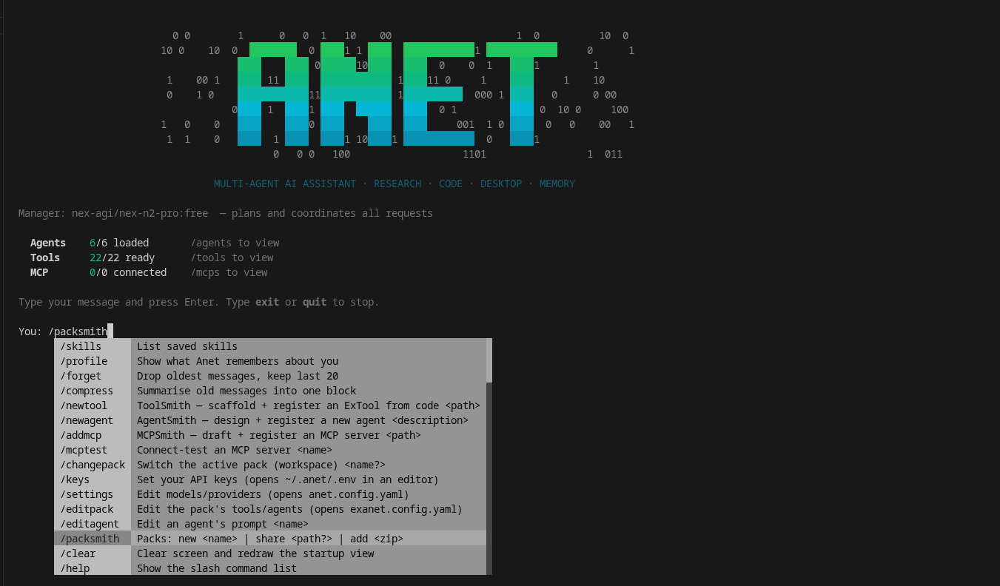

<h1 align="center">ANet Packs</h1>



<p align="center">Shareable workspaces for <a href="https://github.com/Arsh910/Anet">ANet</a> — a community home for packs.</p>

---

## What's a pack?

A **pack** is a complete ANet workspace bundled into one folder you can share: its
config (models/providers), custom **tools** and **agents**, **MCP** wiring, learned
**skills**, and persona. Hand someone a pack and they get your *exact* setup — the
same capabilities, ready to use.

A pack is just files, so it's portable and reviewable:

```
<pack>/
├── anet.config.yaml      models / providers
├── exanet.config.yaml    which tools & agents are wired up
├── ExTools/  ExAgents/   custom tools and agents (real code)
├── mcps/                 MCP server configs
├── skills/               learned procedures
└── SOUL.md               persona
```

## What this repo is for

A place to **share and discover** ANet packs — purpose-built setups others can
install and build on (a "DevOps" pack, a "research analyst" pack, a "frontend"
pack, and so on). Browse, grab one that fits, or contribute your own.

## Using a pack

With ANet installed, add a pack from its zip and switch to it:

```text
/packsmith add <path-to-pack.zip>
/changepack <pack-name>
```

ANet imports it into `~/.anet/shared_packs/`, asks for any API keys it needs, and
runs only the setup its README documents.

## Making one

Start from a base and fill it in — every pack begins from a working workspace:

```text
/packsmith new <name>        # creates ~/.anet/yourpacks/<name>, seeded + active
/newtool  <path>             # ToolSmith  — scaffold + register an ExTool
/addmcp   <path>             # MCPSmith   — draft + connect-test an MCP server
/newagent <description>      # AgentSmith — design + register an agent
/packsmith share             # bundle it → a sanitized, installable .zip
```

The smiths only ever write to your active pack (`exanet.config.yaml` + the
`ExTools/ExAgents/mcps/` folders) — never ANet's core. You can also hand-author any
of these files; the smiths and a developer write to the exact same places, so you
can freely mix.

`/packsmith share` strips secrets, drops `node_modules`/`.git`, **strips the code of
any repo-backed MCP** (see below), and embeds a generated recipient README.

## Authoring rules — so PackSmith can share it cleanly

A pack shares well when each piece declares **how to obtain it** and **what it
needs**. The rule of thumb: *code you wrote travels in the zip; anything large or
external (a cloned MCP repo, a pip package, an API key) does not — so it must be
documented.* The smiths write these docs for you; if you hand-author, follow the
same shape. PackSmith reads them (with a model) to write accurate setup steps, so
even a rough README is usable.

**MCP servers** — `mcps/<name>/README.md`. Two cases:

- **Package-based** (`npx`/`uvx` a published server) — the cleanest. Ships as-is;
  the recipient just needs the runtime.
  ```markdown
  # <name> MCP
  Source: package
  Install: none — `npx <pkg>` fetches it on first run
  Entry: npx <pkg>
  Env: none
  ```
- **Repo-backed** (runs from cloned/built code, e.g. a `node dist/bin/server.js`).
  PackSmith **automatically strips the cloned code from the zip** (it detects the
  project's `package.json`/`pyproject.toml`) and ships only `config.yaml` + this
  README — so the README **must** say how to rebuild it:
  ```markdown
  # <name> MCP
  Source: repo
  Repo: https://github.com/owner/<name>
  Install: git clone … && npm install && npm run build
  Entry: node <your-clone>/dist/bin/server.js   # what config.yaml should point at
  Env: SOME_API_KEY        # or: none
  ```

**Tools** — `ExTools/<name>/README.md`, only if it needs more than the stdlib:
```markdown
# <name> tool
What it does: one sentence.
Requires:
  - pip: <packages>          # omit lines that don't apply
  - system: <CLIs on PATH>
  - repo: <git url>          # only if it shells out to / imports local repo code
Env: SOME_API_KEY            # or: none
```

**Agents** — keep `ExAgents/<name>/.env.example` listing every key the agent needs
(PackSmith reads it to tell recipients what to set; the real `.env` is stripped). A
one-line summary at the top of `prompt.md` (or an `ExAgents/<name>/README.md`) helps.

> Full per-folder guides ship inside every pack: `mcps/README.md`,
> `ExTools/README.md`, `ExAgents/README.md`.

### Pre-share checklist

- [ ] Each MCP is **package-based**, or has a `README.md` with `Source`/`Repo`/`Install`/`Entry`
- [ ] Each non-stdlib tool has a `README.md` listing `Requires` + `Env`
- [ ] Each agent's `.env.example` lists its keys (real `.env` files are auto-stripped)
- [ ] `/mcptest <name>` passes for every MCP
- [ ] `/packsmith share` reports the expected `stripped_mcp_code` and no leaked secrets

## A note on trust

A pack contains **runnable code** (tools, MCP servers). Treat installing one like
installing an extension — review what's inside before you activate it. Secrets are
never bundled: you supply your own API keys locally.

---

<p align="center"><sub>For ANet itself, see the <a href="https://github.com/Arsh910/Anet">main repo</a>. MIT licensed.</sub></p>
