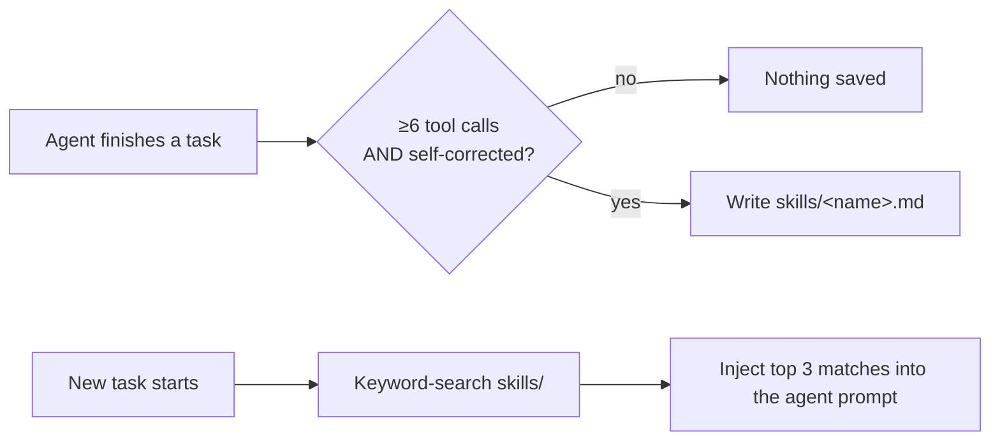

# skills — ANet's self-improving procedure memory

`skills/` is where ANet stores **reusable procedures it has learned**. Each skill
is a small markdown file describing *when* to use it and the *steps* to follow.
Before every agent task, ANet keyword-searches this folder and injects the most
relevant skills into the agent's prompt — so it gets better at recurring tasks
over time.

> Most skills are written **automatically**. You can also drop in your own by
> hand — the format is plain markdown (below).

---

## How skills work



- **Creation** — after a task where an agent made **≥6 tool calls** *and*
  **self-corrected** at least once, a background judge decides whether it's worth
  saving. Most tasks are *not* — it's deliberately selective.
- **Injection** — before each task, the folder is keyword-matched against the
  request (filename + first lines). Up to 3 matches are injected as *"Relevant
  Skills from Past Experience."* No match → nothing injected, no noise.
- **Curator** — at startup, if `skills/` has ≥5 files, a background pass merges
  duplicates and improves skills used ≥3 times. Originals are archived to
  `skills/archived/`. The Curator only touches **agent-created** skills.
- View everything with **`/skills`** (shows each skill's description + usage).

Tuning lives in `anet.config.yaml`:

```yaml
skills:
  enabled: true
  creation_threshold: 6    # min tool calls before a skill is considered
  curator_min_skills: 5    # min files before the Curator runs at startup
  max_injected: 3          # max skills injected per task
```

---

## Add a skill by hand

There's no smith for skills — but authoring one is just writing a markdown file.
Create `skills/<name>.md` using the same format ANet generates:

```markdown
## deploy_vite_app
**Applies to:** building and previewing a Vite + React app from scratch
**Steps:**
1. Run `npm create vite@latest <dir> -- --template react`.
2. `cd <dir> && npm install`.
3. Start the dev server with `npm run dev` and confirm it serves on :5173.
4. If the page is blank, check the browser console and fix import paths.
**Notes:** Always use absolute paths in tasks. Never assume the port is free.
**Created:** 2026-06-17
**Used:** 0
**Last improved:** 2026-06-17
```

Rules of thumb:

- **Filename = the skill name** (`snake_case.md`). Matching scores against the
  filename and the first few lines, so make both descriptive.
- Keep **`## <name>`** as the first line and **`**Applies to:**`** as a one-line
  trigger — that's what the search and the `/skills` list read.
- Make `**Steps:**` concrete and actionable (exact commands, not vague advice).
- The `**Used:**` / `**Created:**` / `**Last improved:**` lines are metadata ANet
  maintains; set them once and it takes over.

> Hand-authored skills are **never deleted or rewritten by the Curator** — it
> only touches skills it created itself. Your files are safe.

---

## Checklist

- [ ] `skills/<name>.md` exists, filename in `snake_case`
- [ ] First line is `## <name>`, followed by `**Applies to:**`
- [ ] `**Steps:**` are concrete and reference exact commands/paths
- [ ] Confirmed it loads — trigger a matching task, or run `/skills`
